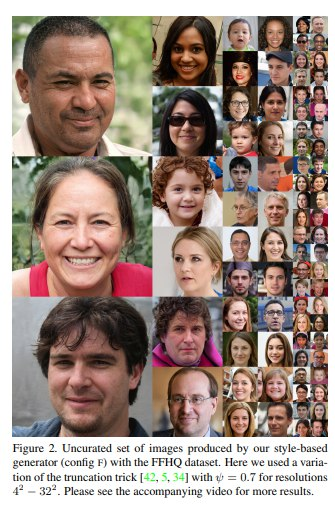
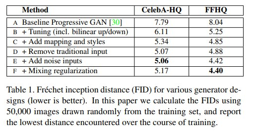
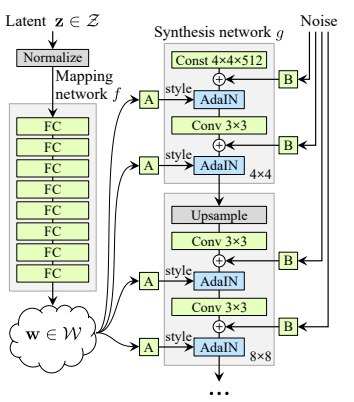

# Paper Review: A Style-Based Generator Architecture for Generative Adversarial Networks

* **Title**: A Style-Based Generator Architecture for Generative Adversarial Networks
* **Authors**: Tero Karras, Samuli Laine, Timo Aila
* **[Link](https://arxiv.org/pdf/1812.04948.pdf)**
* **Tags**: Generative Adversarial Networks, Style-based generator, Faces Datasets
* **Year**: 2019

# Summary

* **What:**

  * The authors propose an alternative generator architecture for generative adversarial networks, borrowing from style transfer literature 
  * The new generator improves the state-of-the-art in terms of traditional distribution quality metrics
  * The authors propose two new, automated methods that are applicable to any generator architecture
  * The authors introduce a new, highly varied and high-quality dataset of human faces The (FFHQ, Flickr-Faces-HQ).

* **Method:**

  (A) Baseline configuration is the Progressive GAN
  (B) The baseline using bilinear up/downsampling operations, longer training, and tuned hyperparameters
  (C) Improving the baseline by adding the mapping network and AdaIN operations
  (D) Simplify the architecture by removing the traditional input layer and starting theimage synthesis from a learned 4 × 4 × 512 constant tensor
  (E) Adding the noise inputs
  (F) Adding the mixing regularization
  
  

* **Results:**

  * **Frechet inception distance (FID)**

 

## Architecture

the mapping network f consists of 8 fully convolutional layers
the synthesis network g consists of 18 layers— two foreach resolution (4**2 − 1024**2).
The output of the last layer is converted to RGB using a separate 1 × 1 convolution

## Blocks description
* **W** - an intermediate latent space
* **AdaIN** - adaptive instance normalization (AdaIN(xi , y) = ys,i xi − µ(xi) σ(xi) + yb,i,)
* **A** - learned affine transform
* **B** - an uncorrelated Gaussian noise
